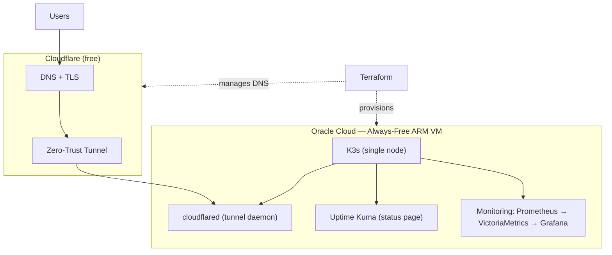

# infra — $0/Month Production Platform

Infrastructure-as-code and GitOps manifests for a production-grade platform running **entirely on free-tier services** — total run cost **$0/month**. This is the infrastructure behind [karthikhegde.in](https://karthikhegde.in): a single-node **K3s** cluster on Oracle Cloud's Always-Free ARM tier, fronted by a **Cloudflare Tunnel** (zero-trust, no open ports) and monitored with **Prometheus + VictoriaMetrics + Grafana**.


---

## Architecture



**Ingress is zero-trust:** no inbound ports are open on the VM. `cloudflared` dials out to Cloudflare, and all traffic reaches services through the tunnel — the origin is never directly reachable.

---

## The $0/month stack

| Layer | Tech | Free tier |
|---|---|---|
| Compute | Oracle Cloud Always-Free **ARM (Ampere A1)** | 4 vCPU / 24 GB |
| Kubernetes | **K3s** (single node) | self-hosted |
| IaC | **Terraform** (OCI + Cloudflare providers) | free |
| Ingress / DNS / TLS | **Cloudflare Tunnel** (Zero Trust) | free plan |
| Monitoring | **Prometheus + VictoriaMetrics + Grafana** | self-hosted |
| Status page | **Uptime Kuma** | self-hosted |

---

## Repository layout

```
.
├── bootstrap/
│   └── cloud-init.yaml          # VM first-boot provisioning
├── terraform/                   # Infrastructure as Code
│   ├── compute.tf               #   Oracle Cloud ARM instance
│   ├── networking.tf            #   VCN, subnet, security lists (default-deny)
│   ├── cloudflare.tf            #   DNS records for the tunnel
│   ├── variables.tf / outputs.tf / versions.tf / main.tf
│   └── terraform.tfvars.example #   copy → terraform.tfvars (git-ignored)
├── scripts/
│   └── tunnel-setup.sh          # creates the Cloudflare tunnel + k8s secret
└── k8s/                         # Kubernetes manifests
    ├── cloudflared/             #   tunnel daemon (secret created manually)
    ├── monitoring/
    │   ├── prometheus/          #   scrape config + RBAC + storage
    │   ├── victoriametrics/     #   long-term metric storage
    │   └── grafana/             #   dashboards + provisioning
    └── uptime-kuma/             #   status page
```

---

## How to deploy

```bash
# 1. Provision the VM + networking + DNS
cd terraform
cp terraform.tfvars.example terraform.tfvars   # fill in OCI + Cloudflare values (git-ignored)
terraform init && terraform apply

# 2. K3s is installed via bootstrap/cloud-init.yaml on first boot.
#    Pull the kubeconfig from the VM and point kubectl at it.

# 3. Create the Cloudflare tunnel + its Kubernetes secret
./scripts/tunnel-setup.sh

# 4. Apply the workloads
kubectl apply -R -f k8s/
```

---

## Security notes

- **No secrets in git.** `terraform.tfvars`, the cloudflared credentials JSON, and `k8s/cloudflared/secret.yaml` are all git-ignored; only `*.example` templates are committed.
- **Default-deny networking** — the security list opens nothing for apps; ingress is exclusively via the Cloudflare Tunnel.
- **Least-privilege RBAC** for the Prometheus service account (`k8s/monitoring/prometheus/rbac.yaml`).

## Why I built it

A place to practice real DevOps/SRE — cluster ops, GitOps, IaC, observability, zero-trust networking — on production-grade tooling without a cloud bill. Everything here is reproducible from code.

---

**Author:** Karthik B Hegde — DevOps / SRE Engineer, Bengaluru
[karthikhegde.in](https://karthikhegde.in) · [LinkedIn](https://www.linkedin.com/in/karthik-hegde-9112b6198) · [GitHub](https://github.com/KarthikHegde91)
